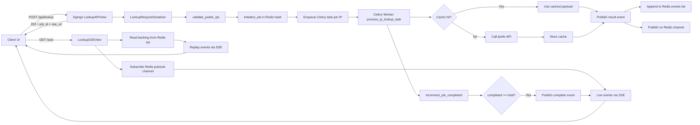

# IP Streamer - Asynchronous Public IP Lookup with SSE

IP Streamer is a Django-based service that accepts a batch of IP addresses, validates them, processes each lookup asynchronously with Celery, and streams live results back to the client using Server-Sent Events (SSE).

The design is optimized for one-way, near-real-time updates from server to UI, while keeping the backend simple, scalable, and resilient to transient upstream failures.

## Table of Contents

- [IP Streamer - Asynchronous Public IP Lookup with SSE](#ip-streamer---asynchronous-public-ip-lookup-with-sse)
	- [Table of Contents](#table-of-contents)
	- [What This Project Does](#what-this-project-does)
	- [Architecture Overview](#architecture-overview)
	- [Why This Architecture](#why-this-architecture)
	- [Why SSE Instead of WebSocket](#why-sse-instead-of-websocket)
	- [Request and Data Flow](#request-and-data-flow)
	- [Workflow Diagram (Mermaid)](#workflow-diagram-mermaid)
	- [Project Structure](#project-structure)
	- [API Endpoints](#api-endpoints)
	- [Event Contract](#event-contract)
	- [Caching, Retry, and Reliability](#caching-retry-and-reliability)
	- [Configuration](#configuration)
	- [How to Run](#how-to-run)
		- [Option A: Docker Compose (recommended)](#option-a-docker-compose-recommended)
		- [Option B: Run individual services manually](#option-b-run-individual-services-manually)
	- [Local Development (Without Docker)](#local-development-without-docker)
	- [Known Gaps and Next Improvements](#known-gaps-and-next-improvements)

## What This Project Does

Given a list of IPs, the system:

1. Validates and normalizes IP addresses.
2. Rejects invalid or non-public IPs.
3. Creates a lookup job in Redis.
4. Dispatches one Celery task per accepted IP.
5. Uses cache-first lookup for fast repeated requests.
6. Calls ipinfo only when cache miss occurs.
7. Publishes each result as an event to Redis (list + pub/sub).
8. Streams those events to clients over SSE.
9. Emits a final complete event when all accepted IPs are done.

## Architecture Overview

Core runtime components:

- Django (ASGI app): Accepts lookup requests, validates input, creates jobs, exposes SSE stream.
- Celery worker: Performs per-IP lookup work asynchronously.
- Redis:
  - Celery broker/backend.
  - Job metadata store (hash).
  - Durable event backlog (list) for SSE replay.
  - Live fanout channel (pub/sub).
  - Django cache backend for IP lookup result caching.
- PostgreSQL: Configured default Django database (not central to lookup flow today, ready for persistence extensions).
- External provider (ipinfo): Upstream IP intelligence source.
- Browser UI: Submits lookup requests and consumes SSE stream with EventSource.

## Why This Architecture

This architecture matches the functional and operational needs of batch lookup + live progress:

1. Non-blocking request handling
   The POST endpoint returns immediately (202 Accepted) after enqueueing tasks, so API latency stays low even for large input lists.

2. Horizontal task scalability
   Celery lets you scale workers independently from web nodes.

3. Fast repeated lookups
   Redis cache avoids repeated external API calls for frequently requested IPs.

4. Replay + real-time delivery
   Storing events in Redis list and publishing over pub/sub allows SSE clients to receive both backlog and live messages.

5. Failure isolation
   Upstream failures in ipinfo do not crash request/response flow; they are contained at task level and sent as per-IP error events.

6. Simpler operational footprint
   Uses well-understood building blocks (Django, Celery, Redis) with straightforward Docker Compose orchestration.

## Why SSE Instead of WebSocket

SSE is the right choice here because the communication pattern is server to client only.

What this project needs:

- Client sends one command (submit IP batch).
- Server sends many asynchronous updates (result events + complete event).
- No continuous client-to-server messaging channel is required after submission.

Why SSE is a better fit than WebSocket in this scenario:

1. Native browser support with EventSource
   No custom protocol handling or socket lifecycle complexity on the frontend.

2. HTTP-friendly infrastructure behavior
   Works naturally with standard HTTP semantics and reverse proxies.

3. Lower implementation complexity
   No bidirectional protocol management, fewer edge cases.

4. Built-in event model
   Named events (ready, timeout) and regular message stream are easy to consume.

5. Efficient enough for this workload
   Result streaming frequency and payload sizes are moderate.

## Request and Data Flow

Detailed flow for one lookup request:

1. Client submits IP list
   Frontend posts JSON body {"ips": [...]} to /api/lookup/.

2. Input validation and normalization
   LookupRequestSerializer validates the ips field and calls validate_public_ips.
   - Invalid format -> rejected as invalid_ip.
   - Valid but non-global -> rejected as not_public_ip.
   - Valid public IPs are normalized and accepted.

3. Job initialization
   A job_id (UUID) is created.
   initialize_job stores Redis hash with:
   - total: number of accepted IPs
   - completed: 0
   - created_at
     and sets job TTL.

4. Task dispatch
   One Celery task process_ip_lookup_task is enqueued per accepted IP.

5. API response
   API returns 202 with:
   - job_id
   - accepted/rejected counts
   - accepted/rejected lists
   - absolute sse_url for that job

6. SSE connection
   Client opens EventSource to /sse/<job_id>/.
   SSE endpoint:
   - verifies job exists.
   - subscribes to Redis pub/sub channel.
   - replays backlog events from Redis list.
   - streams live events.
   - sends heartbeat keep-alive frames.
   - closes with timeout event when idle/max duration exceeded.

7. Worker execution (per IP)
   Task attempts:
   - cache lookup first.
   - if miss, fetch from ipinfo.
   - cache fresh result.
   - publish result event (ok/cache or ok/ipinfo).

8. Retry and error handling
   Transient network exceptions are retried with exponential backoff:
   countdown = min(2^(retry_count+1), 30), max_retries=3.
   After retries exhausted or on non-retryable errors, task publishes error result event.

9. Completion signaling
   After each task emits a result event, job completed counter is incremented.
   Once completed >= total, a complete event is published.
   SSE client receives it and closes stream flow naturally.

## Workflow Diagram (Mermaid)



## Project Structure

Top-level:

```text
.
|-- docker-compose.yml
|-- README.md
`-- ip_streamer/
	 |-- Dockerfile
	 |-- manage.py
	 |-- pyproject.toml
	 |-- core/
	 |   |-- conf.py
	 |   |-- ip_lookup.py
	 |   |-- serializers.py
	 |   |-- tasks.py
	 |   |-- urls.py
	 |   |-- views.py
	 |   `-- templates/lookup.html
	 `-- ip_streamer/
		  |-- settings.py
		  |-- celery.py
		  `-- urls.py
```

Important files and responsibilities:

- core/serializers.py
  - Input schema, validation pipeline, job creation, task dispatch.
- core/tasks.py
  - Async worker logic, retry strategy, cache-first lookup, completion publishing.
- core/ip_lookup.py
  - Redis key helpers, job/event persistence, ipinfo fetcher, cache helpers, SSE formatting.
- core/views.py
  - POST API endpoint and async SSE stream endpoint.
- core/conf.py
  - Constants for event types, statuses, Redis key prefixes, and SSE names.
- core/templates/lookup.html
  - Demo UI for submitting IP batches and rendering live streamed results.
- ip_streamer/settings.py
  - App config, Redis/Celery/cache setup, TTL/timeouts, provider config.
- docker-compose.yml
  - Web, Celery, Redis, PostgreSQL service orchestration.

## API Endpoints

1. Submit lookup job

- Method: POST
- Path: /api/lookup/
- Body:

```json
{
  "ips": ["8.8.8.8", "1.1.1.1", "208.67.222.222"]
}
```

- Success response: 202 Accepted

```json
{
  "job_id": "uuid",
  "accepted_count": 2,
  "rejected_count": 1,
  "accepted_ips": ["8.8.8.8", "1.1.1.1"],
  "rejected_ips": [{ "ip": "192.168.1.1", "reason": "not_public_ip" }],
  "sse_url": "http://localhost:8000/sse/<job_id>/"
}
```

2. Stream lookup events

- Method: GET
- Path: /sse/<job_id>/
- Content-Type: text/event-stream
- Accept: text/event-stream
- Behavior:
  - Emits ready event when stream starts.
  - Emits result events as each IP finishes.
  - Emits complete event once all accepted IPs are processed.
  - Emits timeout event if stream exceeds configured idle/max limits.

1. Docs

- /swagger/
- /redoc/
- /swagger.json or /swagger.yaml

## Event Contract

Result event payload:

```json
{
  "type": "result",
  "status": "ok",
  "ip": "8.8.8.8",
  "source": "cache",
  "data": {
    "ip": "8.8.8.8",
    "country": "United States"
  },
  "job_id": "...",
  "message_id": "...",
  "sent_at": "2026-04-09T12:00:00+00:00"
}
```

Error result event example:

```json
{
  "type": "result",
  "status": "error",
  "ip": "8.8.8.8",
  "source": "ipinfo",
  "error": "Transient ipinfo failure after retries: ...",
  "job_id": "...",
  "message_id": "...",
  "sent_at": "2026-04-09T12:00:00+00:00"
}
```

Complete event payload:

```json
{
  "type": "complete",
  "status": "done",
  "completed": 3,
  "total": 3,
  "job_id": "...",
  "message_id": "...",
  "sent_at": "2026-04-09T12:00:03+00:00"
}
```

## Caching, Retry, and Reliability

1. Cache-first path
   Each IP is checked in Django cache (Redis-backed) before external call.

2. Retryable upstream failures
   Task retries transient httpx network exceptions up to 3 times with capped exponential backoff.

3. Durable stream replay
   Events are pushed to Redis list so late SSE subscribers can replay prior messages.

4. Live updates
   Events are also published on Redis channel for low-latency streaming.

5. Stream liveness
   Heartbeats are emitted periodically to keep long-lived SSE connections healthy.

## Configuration

The project reads environment variables from .env.

Required/important variables:

- DJANGO_SECRET_KEY
- DJANGO_DEBUG
- DJANGO_ALLOWED_HOSTS
- POSTGRES_DB
- POSTGRES_USER
- POSTGRES_PASSWORD
- POSTGRES_HOST
- POSTGRES_PORT
- CELERY_BROKER_URL (default redis://redis:6379/0)
- CELERY_RESULT_BACKEND (default redis://redis:6379/0)
- REDIS_URL
- REDIS_CACHE_LOCATION (default redis://redis:6379/1)
- IPINFO_BASE_URL (default https://ipinfo.io)
- IPINFO_TOKEN
- IPINFO_HTTP_TIMEOUT_SECONDS
- IP_LOOKUP_CACHE_TTL_SECONDS
- IP_LOOKUP_JOB_TTL_SECONDS
- IP_LOOKUP_SSE_HEARTBEAT_SECONDS
- IP_LOOKUP_SSE_MAX_IDLE_SECONDS
- DEFAULT_THROTTLE_RATE
- DEFAULT_THROTTLE_RATE_DAILY

## How to Run

### Option A: Docker Compose (recommended)

1. Create .env in project root.
2. Add at least:

```env
DJANGO_SECRET_KEY=change-me
DJANGO_DEBUG=True
DJANGO_ALLOWED_HOSTS=localhost,127.0.0.1

POSTGRES_DB=ip_streamer
POSTGRES_USER=postgres
POSTGRES_PASSWORD=postgres
POSTGRES_HOST=db
POSTGRES_PORT=5432

CELERY_BROKER_URL=redis://redis:6379/0
CELERY_RESULT_BACKEND=redis://redis:6379/0
REDIS_URL=redis://redis:6379/0
REDIS_CACHE_LOCATION=redis://redis:6379/1

IPINFO_BASE_URL=https://ipinfo.io
IPINFO_TOKEN=your-ipinfo-token
IPINFO_HTTP_TIMEOUT_SECONDS=10

IP_LOOKUP_CACHE_TTL_SECONDS=10
IP_LOOKUP_JOB_TTL_SECONDS=3600
IP_LOOKUP_SSE_HEARTBEAT_SECONDS=15
IP_LOOKUP_SSE_MAX_IDLE_SECONDS=3600
```

3. Build and start:

```bash
docker compose up --build
```

4. Open application:

- UI: http://localhost:8000/
- Swagger: http://localhost:8000/swagger/
- ReDoc: http://localhost:8000/redoc/

### Option B: Run individual services manually

You need PostgreSQL and Redis running first.

Then run web and worker separately:

```bash
# terminal 1 (inside ip_streamer/)
poetry install
poetry run python manage.py migrate
poetry run gunicorn --bind 0.0.0.0:8000 --workers 4 --worker-class uvicorn.workers.UvicornWorker --keep-alive 15 --timeout 0 ip_streamer.asgi:application

# terminal 2 (inside ip_streamer/)
poetry run celery -A ip_streamer worker -l info
```

## Local Development (Without Docker)

Example quick start:

```bash
cd ip_streamer
poetry install
poetry run python manage.py migrate
poetry run python manage.py runserver 0.0.0.0:8000
```

In another terminal:

```bash
cd ip_streamer
poetry run celery -A ip_streamer worker -l info
```

Ensure REDIS_URL and DB credentials point to your local services.

## Known Gaps and Next Improvements

- Tests are currently not implemented (core/tests.py is empty).
- Data persistence for lookup history is not implemented yet (core/models.py is empty).
- Authentication/authorization is currently open for lookup endpoints (AllowAny).
- Consider adding structured logging, request correlation IDs, and metrics.
- Consider circuit breaking/rate limiting behavior for upstream provider protection.
- Consider frontend UX improvements for reconnect handling and partial failure summaries.

**Author:** Abdelfattah Hamdi
